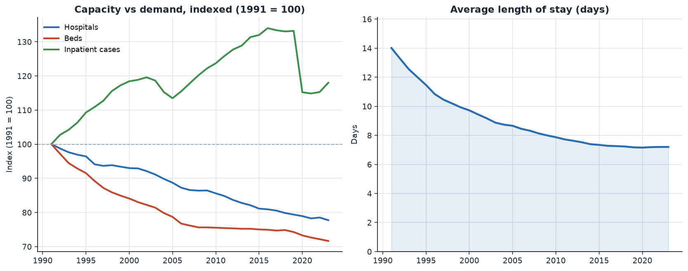
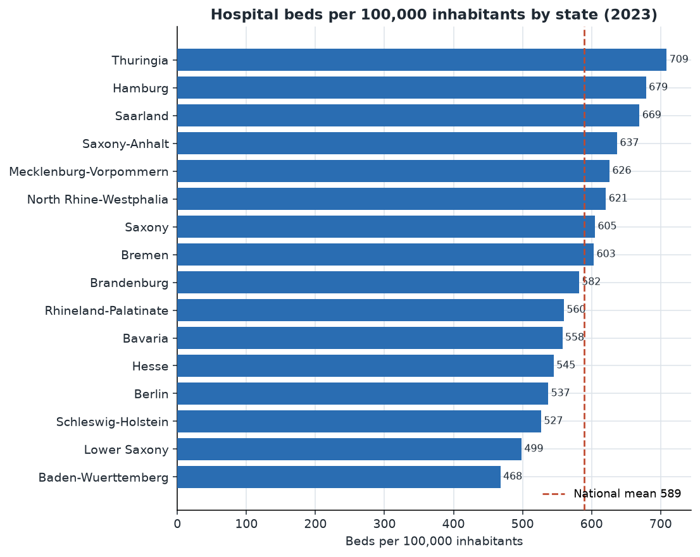
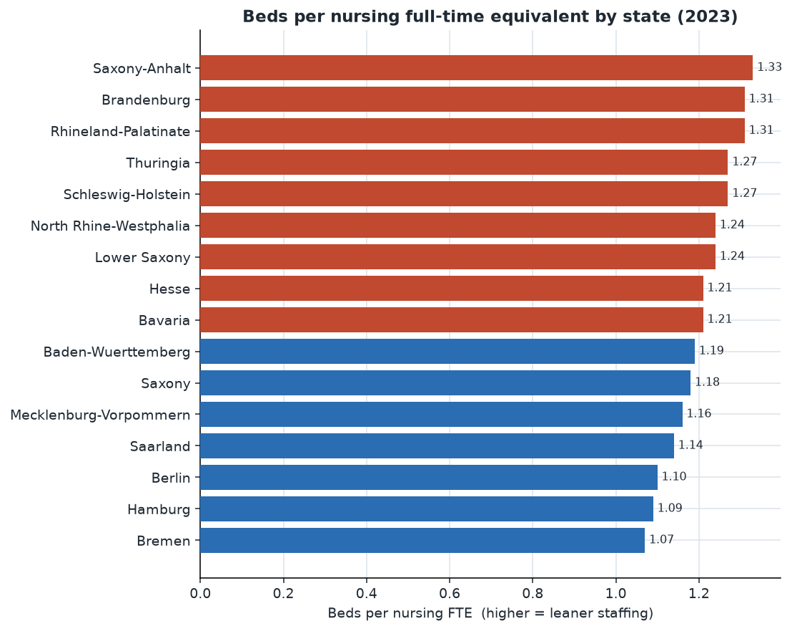

# German Hospital Capacity and Staffing Analysis

**An end-to-end data pipeline over 30+ years of official German hospital statistics, built from scratch by Simaak Haque Fahimuddin Sayed.**

This project takes the raw federal hospital statistics published by the German
statistical office (Statistisches Bundesamt, DESTATIS), cleans them, loads them
into a SQL database, and turns them into a clear picture of how German hospital
capacity, efficiency, and staffing have changed since reunification and how they
differ across the sixteen federal states.

It is a portfolio project: everything here, from the parser to the SQL to the
charts, I wrote myself. The data is real and public, and every number in this
document can be reproduced by running two scripts.

> Research and portfolio use only. This is an analysis of public aggregate
> statistics, not medical advice.

---

## The headline story

Between 1991 and 2023, Germany ran a quiet but dramatic restructuring of its
hospital sector:

| Indicator | 1991 | 2023 | Change |
| --- | --- | --- | --- |
| Hospitals | 2,411 | 1,874 | **-22.3%** |
| Hospital beds | 665,565 | 476,924 | **-28.3%** |
| Inpatient cases | 14.6 million | 17.2 million | **+18.0%** |
| Average length of stay | 14.0 days | 7.2 days | **-49%** |
| Average bed occupancy | 84.1% | 71.2% | -12.9 pp |

The country closed hospitals and cut more than a quarter of its beds, yet it
treated eighteen percent more patients. That was possible because the average
patient now stays half as long as they did in 1991. This is the single clearest
signal in the data: German hospital care shifted from long stays in many beds to
short stays in fewer beds.



---

## Where you live still decides your access to a hospital bed

Averages hide a large regional gap. In 2023, hospital beds per 100,000
inhabitants ranged from about **709 in Thuringia** down to **468 in
Baden-Wuerttemberg**, a **1.5x difference** between the best and least supplied
states around a national average of roughly 589.

The pattern is not random. Several eastern states sit at the top, a legacy of a
different hospital network, while some wealthy western states sit at the bottom.



---

## Nursing staff is stretched differently across the country

Staffing tells its own regional story. I measured nursing intensity as beds per
nursing full-time equivalent: how many beds each nurse, in effect, has to cover.
In 2023 this ranged from about **1.07 beds per nurse in Bremen** (the best
staffed) to **1.33 in Saxony-Anhalt** (the leanest). City states with large
university hospitals cluster at the well-staffed end.



---

## How it is built

The whole thing is a small, honest pipeline. Raw Excel goes in one end and clean
findings come out the other, with a SQL database in the middle so the analysis
is expressed as queries rather than buried in scripts.

```
DESTATIS .xlsx  ->  parse.py  ->  tidy long records  ->  SQLite (star-ish schema)
                                                              |
                                            sql/queries/*.sql (the analysis)
                                                              |
                                    analysis.py  ->  findings.json + CSVs + charts
                                                              |
                                     Streamlit dashboard   +   Power BI model
```

| Stage | Where | What it does |
| --- | --- | --- |
| Extract | `scripts/run_etl.py`, `src/hospital_quality/parse.py` | Reads the DESTATIS workbook's machine-readable sheets, handles German number formats and placeholder markers (a nil cell never silently becomes a zero) |
| Model | `src/hospital_quality/build_db.py`, `sql` | Loads a long `observations` fact table and a `states` dimension (with population) into SQLite |
| Analyse | `sql/queries/*.sql`, `src/hospital_quality/analysis.py` | Three reviewable SQL queries compute national trends, per-capita capacity, and staffing intensity; Python derives the headline numbers |
| Present | `src/hospital_quality/charts.py`, `dashboard/app.py`, `powerbi/` | Static charts, an interactive Streamlit app, and a Power BI build guide |

### The data-cleaning decisions that mattered

Real official data is never clean, and the choices I made here are the ones I
would defend in a review:

- **Placeholder markers are not zeros.** DESTATIS uses `-`, `.`, `...`, `x`, and
  `/` for nil, unknown, not-yet-available, not-applicable, and not-publishable.
  A naive `float()` either crashes or, worse, coerces them to something. I parse
  each into a `value_flag` and keep the numeric value `NULL`, so a suppressed
  cell can never quietly pull an average down.
- **German number formatting.** Thousands use `.` and decimals use `,`. The
  parser normalises both before converting.
- **One row per state, not per breakdown.** The bed table also stores ownership
  and hospital-type splits in the same column. I pin the analysis to the
  all-hospitals total so states are never double counted.
- **Per-capita, not raw.** Comparing raw bed counts across states as different in
  size as North Rhine-Westphalia and Bremen is meaningless, so every capacity
  metric is normalised per 100,000 inhabitants using official population figures.

---

## Reproduce it yourself

```bash
git clone https://github.com/Simaak-Sayed/hospital-quality-de
cd hospital-quality-de
pip install -r requirements.txt

# 1. Download the source workbook (about 2 MB) into data/raw/ (see data/raw/README.md)
# 2. Build the database, then run the analysis:
python scripts/run_etl.py         # xlsx -> SQLite
python scripts/run_analysis.py    # SQL -> findings.json, CSVs, charts

# 3. Explore interactively:
streamlit run dashboard/app.py
```

Tests: `pytest` (the analysis runs against a small synthetic database so the
suite is fast and needs no download).

---

## Skills this project demonstrates

- **Data wrangling**: parsing a messy 94-sheet government Excel workbook, German
  locale number formats, and statistical placeholder handling.
- **SQL**: schema design and analytical queries (conditional aggregation, CTEs,
  cross-table joins, per-capita normalisation against a dimension table).
- **Python**: a typed, tested, `ruff`-clean package (`pandas`, `openpyxl`,
  `sqlite3`, `matplotlib`).
- **Analysis and communication**: turning 37,000 raw observations into a handful
  of defensible findings, and presenting them in static charts, an interactive
  Streamlit dashboard, and a Power BI model.

---

## Sources and licence

- **Hospital data**: Statistisches Bundesamt (Destatis), *Grunddaten der
  Krankenhaeuser* 2023, EVAS 23111. Public statistics, cited in-repo.
- **Population**: Statistische Aemter des Bundes und der Laender, reference date
  31.12.2022.

Code is MIT licensed. The underlying statistics belong to their publishers and
are used here under their terms for analysis and education.
